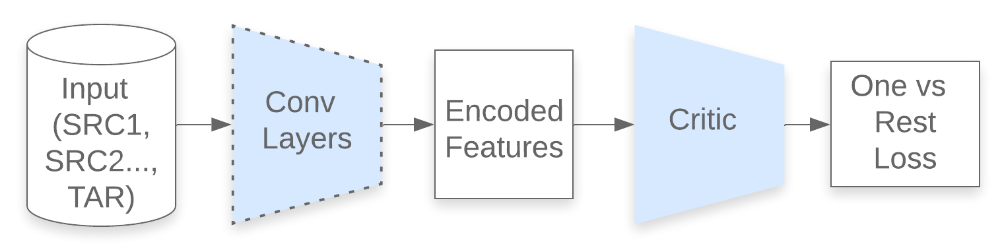
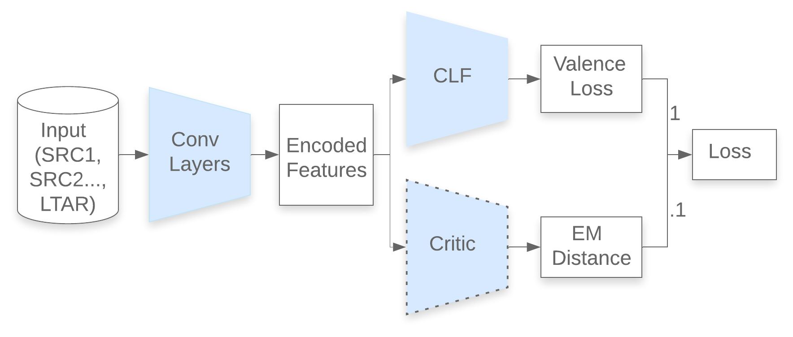

# Maddog Tensorflow 2.0 Keras Implementation
This repository is an implementation of Multiclass Adversarial Domain Generalization (MADDoG) using the original parameters from the [paper](https://web.eecs.umich.edu/~emilykmp/EmilyPapers/2019_Gideon_TAC.pdf).  For the system's details, please refer to the paper.  In the sections that follow, we outline the system at a high level and give a brief overview of the code presented here.

## MADDoG
MADDoG is a deep neural network architecture designed to help mitigate the effects of [domain shift](http://www.cs.cmu.edu/~arthurg/papers/covariateShiftChapter.pdf): the problem that a model trained on one dataset may perform significantly worse on another.  Most approaches to this problem involve some sort of domain adaptation (e.g. [ADDA](https://arxiv.org/pdf/1702.05464.pdf)).  These approaches attempt to make the target dataset "more like" the source (training) dataset so we can use classifiers trained on the source dataset to classify samples from the target dataset.  In the problem of acoustic speech emotion recognition, [Gideon et al](https://web.eecs.umich.edu/~emilykmp/EmilyPapers/2019_Gideon_TAC.pdf) found that this approach did not work, hypothesizing that the adaptation "squeezed" out the relevant emotional content from acoustic features.  To solve this problem, Gideon et al proposed MADDoG, a domain generalization system designed to bring source and target intermediate feature representations iteratively closer together while also incorporating loss from emotion labels.

Each epoch, MADDoG operates in two steps.  In **Step 1**, the critic is trained to take in encoded MFBs and predict a one vs rest classifier for which dataset (dataset index) each example is from.  In **Step 2**, the convolution layers and emotion classifier layers are trained with losses from the emotion prediction and from a penalty based on the size of the critic's outputs at the correct dataset indices (how well the critic predicted which dataset the sample came from). This encourages the convolution layers to make their outputs less discernible by the critic, bringing the representations closer together, while preserving information relevant to emotion prediction.

**Step 1**

**Step 2**

## Code Overview
In this repository, we include an implementation of MADDoG designed for acoustic emotion recognition, but we attempt to make the elements of the system as modular as possible, so this codebase can serve as a starting point for different applications.
* `Maddog.py`: where the heavy lifting happens. The code is structured as follows:
    - `Maddog_Wrapper.init`: takes `args`, which contains
        * `df_src`: the concatenated source datasets as `pandas` dataframes, including paths to the low level acoustic features (`features` column), labels (in this case: `emotion` as a three binned, stringified vector (e.g. `".3;.2;.5"`)), and which dataset the data came from (`dataset`)
        * `df_tar`: the target dataset, containing the same information.
        * `df_ltar`: labelled data from `df_tar` to use for training
        * `df_train`: `df_src` + `df_ltar`
        * `df_val`: labelled data from `df_tar` to use for validation
        * `df_test`: labelled data from `df_tar` to use for testing
    - `Maddog_Wrapper.init` also creates [data generators](https://stanford.edu/~shervine/blog/keras-how-to-generate-data-on-the-fly) using `get_gen_md` and `get_gen_md_critic` to be used in fitting and testing the model.
        * `get_gen_md`: takes in `args` and `training` - whether the input is for training or validation - and returns a generator to be used in keras' `model.fit()`
        * `get_gen_md_critic`: creates the generator to be used in fitting the critic
    - `Maddog_Wrapper.fit` fits `self.full_model` to the training and validation generators, saving the checkpoint of the best model. Each epoch, the critic is trained as a `tf.keras.Callback`.
* `utils.py`: contains minor utility functions for data processing, along with metrics for evaluation
* `models_common.py`: contains different underlying layers used in MADDoG, such as the convolutional layers from the paper, with two convolutional layers using dilation.

